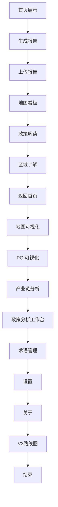

# 自动化演示指南（8分钟以内）

- 演示入口脚本：`./start_demo.py`
- 默认场景：`auto_demo/scenarios/structured_showcase_8min.yaml`
- 依赖：Python 3.10+，已安装 Playwright（`pip install -r auto_demo/requirements.txt` 并运行 `playwright install`），后端服务在 `http://localhost:5000`

## 运行示例
- 无头模式：`python start_demo.py --ss small`
- 可视模式：`python start_demo.py --ss big --headed`
- 录制视频：`python start_demo.py --ss big --record`
- 调整速度：`python start_demo.py --ss small --speed fast`（或 `slow`）
- 指定场景：`python start_demo.py --ss small --scenario auto_demo/scenarios/structured_showcase_8min.yaml`

## 演示流程概览
- 首页展示：突出核心模块，3–5秒停留并高亮入口
- 生成报告：选择类型（3种），填写必填/选填，生成并后台运行
- 上传报告：选择示例文件（MD/TXT），展示进度与分析页面（图表/指标/结果）
- 地图看板：选择成都市/武侯区/锦江区，搜索5类POI，启用热力与聚合，数据面板联动
- 政策解读：列表检索与分类，查看详情（原文/摘要/评估/推荐）
- 区域了解：快速切换成都市/重庆市/四川省，展示概况与指标
- 收尾：返回首页，停留5秒

## 设计要点
- 时长控制：单页滚动 3–6 秒，动作间隔约 1.0–1.5 秒，总时长 < 8 分钟
- 稳定性：每次点击/输入前使用 `wait_for_selector` 保证元素可见
- 性能：默认无头模式，避免不必要的固定等待，导航后按需等待关键选择器
- 日志与提示：控制台输出步骤说明，页面注入字幕提示当前步骤
- 参数化：`--speed` 调整场景中的 `action_delay` 与 `slow_motion`

## 流程示意图（Mermaid）

