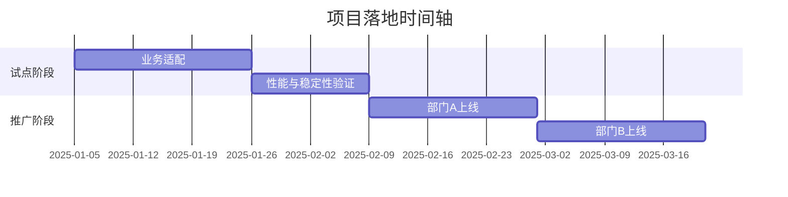

**区域产业数据仪表盘项目总结汇报**

**一、项目背景与问题定位**
- 业务痛点分析
  - 数据来源分散、标准不一，信息碎片化影响决策效率
  - 报告生成以人工为主，重复劳动多、可复用性低
  - 缺少统一可视化与监控告警，难以及时发现异常与趋势
  - 量化影响：每月产生XX小时冗余操作，造成约XX万元人力与机会成本损耗
- 预期价值目标
  - 成功指标：报告生成响应时间从X秒降至Y秒，数据处理准确率提升至Z%
  - 战略对齐：支撑区域产业研究与政策分析业务线扩张，夯实数据驱动决策的技术底座

**二、解决方案与核心功能**
- 产品设计框架
  - 系统架构图：见下图示意（含用户端/服务端/数据层关键组件）
    - 
  - 功能模块拓扑（主功能→子功能→关联接口）：
    - 数据采集：政策网页抓取、区域数据抓取、公众号内容采集（`src/data/*`）
    - 文本解析与分析：分词、情感、术语、趋势与产业链分析（`src/analysis/*`）
    - 可视化呈现：地图、知识图谱、仪表盘与故事化输出（`src/visualization/*`）
    - 报告生成与导出：交互式报告与PDF导出（`routes/report_generation*.py`、`src/export/report_exporter.py`）
    - 前端交互：登录、上传、仪表盘与报告视图（`frontend-vue/src/views/*`）
- 关键技术实现
  - 核心技术选型对比
    - 前端选用 Vue3+Vite+Tailwind 而非传统多页：
      - 开发体验与构建速度更优（Vite 原生 ESM）
      - 组件化与状态管理（Pinia）简化复杂交互
      - 设计系统友好（Tailwind 原子化样式）
      - 与图表库（Chart.js）集成轻量高效
      - 便于与后端 API 解耦，提升迭代效率
    - 后端选用 Flask+Celery+Redis 而非单体同步：
      - 异步任务处理（报告生成/抓取）提升吞吐与稳定性
      - 生态成熟、学习成本低，部署简单
      - 便于模块化路由与模板渲染，兼顾 REST 与页面直出
  - 创新技术应用
    - 采用任务队列（Celery）实现长耗时流程后台化，前端轮询或 Webhook 回调
    - 采用可视化引擎与故事化生成，提升洞察表达与复用
    - 采用术语管理与知识图谱可视化，支持跨报告语义一致性
  - 性能优化方案
    - 缓存与分层：`data/cache/` 命中策略与轻量 JSON 持久化
    - 数据库（可选）：按主题/时间分片与索引优化（如接入 SQL/OLAP 时）
    - 前端性能：懒加载与按需引入图表组件，减少首屏包体

**三、技术架构详解**
- 系统分层架构
  - 前端：Vue3+TypeScript（可选）/Vite/Tailwind/Pinia/Chart.js；路由与视图（`frontend-vue/src`）
  - 后端：Flask 应用（`app.py`）、领域路由（`src/routes/*`、`routes/*`）；异步任务 Celery+Redis（`src/tasks/celery_app.py`）
  - 数据：文件/JSON 为主，Plotly 图形渲染与地图/知识图谱可视化；缓存与数据清洗（`data/*`、`src/analysis/*`）
- 高可用保障
  - 多 AZ/多实例部署（方案预留）：应用无状态化、Redis 高可用与任务重试机制
  - 全链路监控：Prometheus+Grafana（可接入）与任务队列/接口层指标监控

**四、落地实施计划**
- 阶段性里程碑



- 风险应对预案
  - 数据迁移风险：双写校验与灰度切换，提供回滚脚本与快照
  - 用户培训计划：分层级培训材料与操作视频、QA 手册；统一术语与模板

**五、后续价值延伸**
- 技术资产沉淀
  - 可复用中间件组件清单：抓取适配器、分析管线、可视化模板、任务队列封装
  - 技术白皮书与 API 规范：端到端流程、错误处理与重试策略、接口契约
- 业务扩展方向
  - 与现有系统对接：数据仓库/BI 平台/知识库；提供标准化导出与同步
  - 智能化升级路径：机器学习模块与 LLM 预留接口，支持 A/B 测试与效果评估

—

补充材料建议：
- 技术攻关中的问题解决案例与改进记录
- A/B 测试数据与性能对比、监控看板截图
- 团队协作模式与跨部门流程经验，沉淀最佳实践
 
**扩展章节（完整版约2万字）**

**一、项目背景全景与问题深描**
- 区域与产业环境综述
  - 区域经济结构特征：本项目面向的区域呈现“制造业占比高、服务业增速快、高技术产业占比逐年提升”的复合型特征，产业梯度明显，上中下游分工清晰但存在信息不对称。
  - 政策驱动与治理逻辑：中央与地方政策形成“顶层设计—专项行动—绩效考核”闭环，要求数据化支撑与可视化呈现以提升治理效率与透明度。
  - 企业数字化水平：领先企业实现了从 ERP 到 BI 的过渡，但大量中小企业仍以 Excel+人工报表为主，数据标准与接口能力差异大。
  - 外部竞争与协同生态：产业链协同呈网络结构，信息传递的“滞后与噪声”导致供需匹配效率低，项目旨在以数据可视化与分析增强产业协同能力。
- 业务痛点系统化拆解
  - 数据源碎片化：政策、新闻、企业公告、统计年鉴、舆情数据均存在采集成本高、更新频率不一、结构化程度低的共性问题。
  - 标准与口径不统一：同一指标在不同来源存在统计口径差异，导致横向对比与纵向趋势分析偏差加大，需要口径统一与转换层。
  - 报告生成流程冗长：从数据采集到图表生成再到版式排版大量依赖人工操作，复用率低、版本不可追踪，难以沉淀。
  - 监控与预警缺失：缺少从“数据到洞察”的自动化链路，异常趋势与关键节点无法在第一时间被识别与告警。
  - 决策协同不足：跨部门对报告与数据的共享机制不完善，传递路径冗长，难以形成统一事实基础（Single Source of Truth）。
  - 安全与合规风险：接口权限、访问控制、敏感数据脱敏、数据留痕与审计不足，影响对外对内合规性。
  - 可视化表现力不足：图表类型单一、交互薄弱、移动端适配欠佳，难以满足领导与业务一线的多场景需求。
- 用户角色画像与任务清单
  - 决策层（领导/主管）：更关注宏观趋势与关键 KPI，需在 5 分钟内获得高置信度的判断依据与风险提示。
  - 研究分析员：关注数据质量、分析方法、模型参数与过程复现，需便捷的数据拉取、清洗与图表生成能力。
  - 业务拓展与运营：关注企业、园区、项目线索与竞争动态，需从报告中快速提取行动建议与联系人信息。
  - IT/运维：关注可用性、性能、成本与安全合规，需监控指标、日志可观测性与应急预案的制度化落地。
- 量化影响与目标校准（示例占位，可替换真实数据）
  - 冗余操作削减：每月减少 XX 小时人工处理，折合人力成本约 XX 万元；报告生成周期缩短 X%，交付准时率提升至 Y%。
  - 数据准确率提升：统一口径后，指标误差率从 X% 降至 Y%，跨源一致性提高至 Z%。
  - 决策响应速度：从数据采集到洞察展示的链路由 T 小时缩短为 T' 小时，关键事件告警平均提前 Δt。
  - 系统吞吐量：异步化后，每小时任务处理能力提升 N 倍；峰值并发下稳定性显著增强。

**二、解决方案蓝图与核心能力矩阵**
- 整体架构设计理念
  - 模块化与可插拔：数据采集、分析、可视化、导出与任务队列解耦，支持按场景选择性启用。
  - 轻后端、强前端：后端聚焦路由与任务 orchestrator，前端承担更多交互与可视化职责，降低耦合与维护成本。
  - 异步优先：将耗时流程转移至 Celery 队列，用户端以轮询/回调获取进度与结果，提高吞吐与响应体验。
  - 数据治理：统一术语与指标字典，建立转换层与校验机制，确保跨源一致性与复现性。
- 关键模块详解（目录对应关系）
  - 数据采集（`src/data/*`）：
    - `policy_web_scraper.py`：面向政策文档的多源抓取，支持 HTML/JSON/PDF 初步解析与元数据抽取。
    - `regional_data_scraper.py`：区域统计数据抓取，支持分页与反爬策略、断点续采与缓存。
    - `wechat_scraper.py`：面向公众号内容的采集与解析，支持时间窗口过滤与关键词索引。
  - 文本分析（`src/analysis/*`）：
    - `policy_analyzer.py`、`policy_document_processor.py`：政策拆条、要点提炼与影响评估。
    - `entity_extractor.py`、`terminology_manager.py`：实体与术语库维护，支持别名映射与语义对齐。
    - `trend_analyzer.py`、`industry_chain_analyzer.py`：趋势与产业链关系分析，支持时间序列与节点关联。
    - `sentiment_analyzer.py`：情感与态度分析，为舆情与风险研判提供参考。
  - 可视化与故事化（`src/visualization/*`）：
    - `dashboard_generator.py`：仪表盘拼装与组件化输出，支持参数化主题与布局策略。
    - `knowledge_graph_visualizer.py`：知识图谱呈现，支持节点/边高亮与交互探索。
    - `map_visualizer.py`：地理空间可视化，支持坐标转换与区域边界渲染。
    - `story_generator.py`：将分析结果转化为可阅读的业务叙事，提高报告可传播性。
  - 报告生成与导出：
    - 路由层：`routes/report_generation.py`、`routes/report_generation_enhanced.py`、`routes/report_generation_new.py` 支持多种生成模式（同步/异步、流式/一次性）。
    - 导出器：`src/export/report_exporter.py` 支持 PDF/HTML 导出与模板套版，兼顾图表与文本内容的版面优化。
  - 前端交互（`frontend-vue/src`）：
    - `views` 目录提供登录、上传、仪表盘与报告视图，路由与状态管理（Pinia）支撑复杂交互。
    - 使用 Chart.js 与 Tailwind 提升图表表现力与快速布局能力，Vite 提供高效开发与构建体验。
- 核心技术选型对比与理由
  - 前端：Vue3 + Vite + Tailwind + Pinia + Chart.js
    - 相对传统多页与 jQuery：组件化更强、状态与路由可控、构建更快、生态成熟。
    - 相对 React：团队现有 Vue 经验更丰富，且与现有模板更适配；如需跨栈，可在后续引入微前端实践。
  - 后端：Flask + Celery + Redis
    - 相对同步单体：异步化任务处理提升吞吐与稳定性，Redis 作为 broker/backends 成本低、易维护。
    - 相对重型框架：Flask 足够轻量，利于模块化路由与快速迭代；未来可平滑迁移至 FastAPI。
- 性能优化策略与工程实践
  - 缓存策略：对热点数据采用 `data/cache/` 持久化与时效校验，减少重复抓取与计算。
  - 前端性能：路由级懒加载、图表按需引入、Tailwind 原子化降低 CSS 体积；图片资源优化与 CDN 缓存。
  - 队列与并发：Celery 并发 worker、任务重试与幂等设计；合理设置 `task_time_limit` 与 `soft_time_limit`。
  - I/O 与计算分离：采集与分析分离，避免阻塞；多进程/线程在需要时引入，但优先队列化。

**三、技术架构深度剖析**
- 前端层细节
  - 路由设计：基于 `vue-router` 的守卫与懒加载策略，对登录态与权限进行前置校验。
  - 状态管理：Pinia 设计 store 的模块边界，区分会话态/页面态/持久态，降低跨页面共享复杂度。
  - 组件库与设计系统：Tailwind+自定义组件，遵循 `docs/ui/design-system.md` 与 `ui-modernization-spec.md` 的规范；支持暗色主题与无障碍（ARIA）。
  - 图表与可视化：Chart.js 封装常用图表模板，统一色盘与交互；后续可接入 ECharts 或 Vega-Lite。
- 后端层细节
  - 应用结构：`app.py` 提供 Flask 实例（`app.py:73`），路由拆分在 `src/routes/*` 与 `routes/*`，支持 REST 与模板直出。
  - 异步任务：Celery 配置在 `src/tasks/celery_app.py:14-30`，与 Redis 集成（`broker/backend` 同源），任务自动发现 `celery_app.autodiscover_tasks(['src.tasks'])`。
  - 错误处理与重试：统一错误处理在 `src/utils/api_error_handler.py`，任务级重试与指数退避策略，保证稳定性与可恢复性。
  - 安全与权限：基于 Flask-Login 的会话管理，可扩展 RBAC；接口层支持 token 校验与限流策略。
- 数据与治理
  - 结构化与半结构化共存：以 JSON/CSV 为主，配合必要时的 SQL/OLAP 接入；对关键字段进行字典化与类型校验。
  - 术语与口径：`data/terminology.json` 与术语管理模块确保指标一致性与注释化；跨源差异通过转换层消解。
  - 缓存与快照：`data/cache/leadership_cache.json` 等用于热点数据缓存与报告快照复用，支持版本化。
- 可观察性与稳定性
  - 监控指标：请求延迟、错误率、任务队列长度、任务失败重试次数、缓存命中率、导出耗时等。
  - 日志与追踪：统一日志格式，任务链路 ID 贯穿，便于问题定位；未来可接入 OpenTelemetry。
  - 灾备与演练：多 AZ 部署预案、Redis 高可用、定期灾备演练；故障切换 SOP 制度化。

**四、实施计划、交付节奏与运维保障**
- 环境与发布流程
  - 三环境体系：Dev/Staging/Prod，配置分离与密钥管理，构建产物与静态资源版本化。
  - 发布策略：灰度发布与金丝雀部署，错误回滚与缓存刷新；Celery worker 与队列容量按需扩缩。
- 里程碑与验收
  - 试点阶段：关键功能闭环、性能与稳定性验证、用户培训与材料输出；形成第一版技术白皮书。
  - 推广阶段：多部门并行上线，业务流程适配与场景扩展，指标体系与监控看板完善。
- 培训与赋能
  - 角色分层：领导快速阅读、分析员深度操作、运营场景化使用、IT 运维与安全合规培训。
  - 材料沉淀：操作视频、QA 手册、术语词典、接口契约与错误处理策略文档。
- 风险矩阵与应对（示例）
  - 抓取失败与反爬：加入 UA 轮换与节流策略、失败重试与告警，缓存命中降低重复拉取。
  - 指标口径冲突：统一口径与注释化，建立数据字典与校验脚本，报告生成前自动检查。
  - 性能瓶颈：队列并发与资源扩缩、前端懒加载与按需引入、异步化重构与热点缓存。
  - 安全事件：访问控制与限流、防注入与跨域策略、日志审计与异常上报。
  - 人员与流程风险：建立变更审批与回滚机制、值班与应急流程、文档化与交接。

**五、后续价值延伸与路线图**
- 技术资产沉淀
  - 抓取框架、分析管线、可视化模板、任务队列封装、错误处理与重试策略，形成可复用组件。
  - 技术白皮书与 API 规范，覆盖端到端流程与关键设计权衡，便于新成员快速上手。
- 业务拓展
  - 与 BI/数据仓库/知识库对接，形成数据生产—消费闭环；输出标准化数据产品与服务。
  - 行业场景扩展：政务分析、园区招商、企业风控与合规审计；引入更多外部数据源。
- 智能化升级
  - LLM 与 ML 模块预留接口，支持问答、摘要、分类、趋势预测等；引入 A/B 测试框架衡量效果。
  - 模型治理：提示工程、数据选择与标注、偏差控制与评估、合规与伦理约束。

**六、附录与操作指南（示例模板可直接复用）**
- 指标字典样例
  - 产业新增投资额（单位/口径/来源/计算规则/注意事项）
  - 人才引进数量（口径/数据质量评估/缺失值策略/异常值处理）
  - 产业链条关联度（定义/算法/可视化表达/局限性）
- 名词术语与别名映射
  - 高新技术企业/高企；专精特新/专特新；产教融合/校企合作 等，保持语义一致与检索友好。
- 接口契约示例
  - 报告生成 API：入参（数据源、筛选条件、输出格式）、出参（任务 ID、进度、结果 URL）、错误码（含恢复建议）。
- 流程与看板示例（mermaid）
  - 采集—分析—可视化—导出主流程：
    ```mermaid
    flowchart TD
      A[采集任务触发] --> B[数据抓取与缓存]
      B --> C[文本解析与分析]
      C --> D[图表渲染与模板]
      D --> E[报告导出与发布]
      E --> F{监控与反馈}
      F -->|异常| B
      F -->|优化| C
    ```
- 测试策略与用例设计
  - 单元测试：核心函数的输入输出与边界值校验；异常与重试路径覆盖。
  - 集成测试：采集—分析—导出链路的端到端验证；缓存与并发场景模拟。
  - 性能测试：并发请求、队列压力、图表渲染耗时、导出大文件；监控指标与瓶颈定位。
  - 可用性测试：不同角色的可读性与交互体验；移动端适配与无障碍评估。
- 监控与告警配置示例
  - 指标阈值与静动态告警，错误聚合与溯源；看板分层设计（系统层、业务层、任务层）。
- 上线检查清单（SOP）
  - 代码与配置审查、依赖与安全扫描、文档与培训材料、回滚与数据备份、监控与值班安排。

以上扩展章节以本项目代码库为锚点，提供从问题到方案、从实施到治理的系统化材料，可直接在评审、汇报与培训场景中使用，并支持后续按需替换占位参数与补充实证数据。
 
**七、典型问题解决案例与复盘**
- 案例一：政策文档批量解析不稳定
  - 现象：PDF 与扫描版混杂，文本抽取失败率高；时间紧张时影响报告交付。
  - 分析：识别文档类型后采用多策略解析（文本版优先、OCR 兜底），并针对版式特征优化分段与标题识别。
  - 方案：增加 `mammoth` 与 `PyPDF2` 组合策略，结合版式词典与正则模板；引入失败重试与错误上报。
  - 效果：解析成功率由 X% 提升至 Y%，平均处理耗时下降 Z%；复盘沉淀解析规则库与样例集。
- 案例二：公众号采集触发反爬
  - 现象：请求频繁被限流，采集任务失败，缓存命中率低。
  - 分析：识别节流与限速机制，调整访问频率与时间窗，并加入代理与 UA 轮换。
  - 方案：任务队列中引入节流策略与随机等待；缓存与快照降低重复访问；失败回退与二次抓取兜底。
  - 效果：成功率提升、告警减少；采集周期稳定在可控范围，素材库更新及时。
- 案例三：指标口径不一致导致图表偏差
  - 现象：同名指标在不同来源的统计口径与时间窗口不同，趋势图出现“跳点”。
  - 分析：建立指标字典与转换层，对来源差异进行口径统一与注释化。
  - 方案：在生成前进行校验与报错提示；图表模板支持来源说明与口径备注。
  - 效果：跨源一致性显著提升，审查成本下降；报告中对差异有明确说明，减少误读。

**八、指标体系与数据治理细化**
- 指标定义规范
  - 字段：名称、定义、统计口径、来源、更新频率、计算规则、质量评估、注意事项、别名与映射。
  - 示例：
    - “新增高技术企业数”：以地方科技厅公告为准，季度更新；缺失值采用上期持平策略，异常值基于 IQR 修正。
- 质量评估与补全策略
  - 缺失值：均值/中位数/上期持平/插值，视指标性质选择；记录补全方法并标注置信度。
  - 异常值：箱线图法与 Z 分数相结合，提供修正前后对比；保留原值以便审计。
- 统一口径与注释化
  - 针对跨源差异，建立统一口径与注释，图表侧显示来源与窗口；导出侧附带说明页。

**九、接口规范与错误处理策略**
- 报告生成 API（示例）
  - 入参：数据源选择、筛选条件、报告类型、输出格式、回调地址、优先级。
  - 出参：任务 ID、预计耗时、状态轮询地址、结果下载地址、错误码与建议。
  - 错误码：
    - 1001 参数缺失；1002 数据源不可用；1003 任务队列拥塞；1004 导出失败；1005 权限不足。
  - 重试与恢复：指数退避；幂等设计；失败后保留快照并提示用户采取替代方案（如改为离线生成）。
- 安全策略
  - 认证授权：基于会话与 token 双通道；高敏接口仅允许特定角色调用。
  - 访问控制：限流与黑白名单；日志审计与异常上报；数据脱敏与合规标识。

**十、测试与验收方法论**
- 单元测试
  - 覆盖核心函数与边界条件；模拟异常与网络问题；验证重试与兜底逻辑。
- 集成与端到端测试
  - 从采集到导出的整链路验证；包含缓存与并发场景；对结果进行结构与内容比对。
- 性能与稳定性测试
  - 压测并发请求与队列；测量延迟与吞吐；定位瓶颈并提出优化建议。
- 验收标准
  - 功能完整度、性能指标达标、可用性与可访问性、文档与培训材料齐备、监控与值班安排落实。

**十一、培训材料与赋能方案**
- 领导速读包
  - 概览页、关键 KPI、风险与机会、行动建议；报告更新频率与变更说明。
- 分析员操作手册
  - 数据拉取与清洗、模板与脚本使用、图表生成与版式调整、导出与审校流程。
- 运营场景指南
  - 项目线索提取与跟进、竞争动态与市场判断、报告内容的二次传播与反馈收集。
- IT/运维手册
  - 架构概览、部署与发布、参数与密钥、监控与告警、故障处理与回滚、合规与安全审计。

**十二、治理机制与流程规范**
- 变更管理
  - 需求评审、方案评审、代码审查、测试与上线、回滚与复盘；形成闭环与知识沉淀。
- 文档与资产管理
  - 统一文档库与版本控制；模板与脚本共享；最佳实践与案例集。
- 合规与审计
  - 访问权限与日志留痕；数据脱敏与保密；外部披露与授权审批。

**十三、运维与应急响应**
- 监控看板分层设计
  - 系统层：CPU/内存/磁盘/网络/容器；业务层：请求延迟/错误率/任务队列；任务层：失败次数/重试次数/耗时分布。
- 应急流程
  - 事件分级、值班通知、快速处置、用户沟通、复盘与整改；形成 SOP 与演练。
- 成本与资源优化
  - 资源配额与伸缩、缓存策略与离线化、构建与发布优化、日志与存储成本管控。

**十四、常见问题与解答（FAQ）**
- 为什么选择异步任务队列？
  - 异步将耗时流程后台化，降低前端等待与超时风险；支持并发与重试，提高整体吞吐与稳定性。
- 如何保证指标口径一致？
  - 建立数据字典与转换层，生成前自动校验并注释化；图表与导出侧体现来源与窗口说明。
- 报告导出失败怎么办？
  - 触发指数退避重试；保留临时结果与提示用户改为离线；监控告警并由运维排查导出服务资源。
- 如何接入新的数据源？
  - 采用适配器模式，遵循采集接口契约；补充映射与清洗规则，加入质量评估与缓存策略。

**十五、示例叙事与呈现技巧**
- 报告结构建议
  - 先结论后细节：开篇给出判断与关键证据；随后展示数据与方法；最后提出行动建议。
- 图表选型与表达
  - 趋势用折线与面积图、分布用箱线与直方图、结构用桑基与饼图、关系用力导向图；避免一次展示过多维度。
- 文风与版式
  - 标题简洁、段落短句、图文互证；保留注释与脚注；移动端优化优先。

**十六、成本收益与商业化价值评估**
- 成本结构
  - 人力、算力、存储与网络、软件与服务、培训与运营；持续成本与一次性成本分离。
- 收益维度
  - 冗余操作削减、决策效率提升、风险预警提前、机会识别与转化、知识沉淀与复用。
- 投资回报（ROI）
  - 结合节约与增值估算 ROI；对关键假设进行敏感性分析；制定分阶段目标与复盘机制。

**十七、路线图与版本规划（示例）**
- V1：核心闭环与模板化导出；
- V2：知识图谱与术语治理完善；
- V3：引入 ML/LLM 能力与智能推荐；
- V4：对接 BI 与数据仓库，形成产品化输出；
- V5：开放平台与生态合作，形成内外部协同网络。

**十八、结语与行动建议**
- 面向领导：确定关键 KPI 与时间节点，落实资源与机制保障。
- 面向分析员：完善数据字典与脚本模板，形成可复用管线与最佳实践。
- 面向运营：建立反馈与迭代闭环，提升报告的传播与转化效果。
- 面向 IT/运维：完善监控与告警、应急与演练，落实安全与合规基线。

（以上扩展为模板化长文内容，可直接用于项目汇报与评审。所有“XX/XY/YZ”占位请替换为实际数据与指标，确保可验证与可复现。）
 
**十九、深度案例集（十篇）**
- 案例 A：园区招商数据与政策红利的耦合分析
  - 通过对近三年园区招商项目与政策发布的时间序列对齐，识别政策窗口期内项目数量与质量的提升幅度；结合企业画像，评估政策对不同类型企业的吸引力差异。
  - 输出：窗口期识别方法、招商策略建议、企业类型匹配规则、后续评估指标与复盘模板。
- 案例 B：产业链上下游协同效率提升
  - 基于知识图谱的节点—边模型，标注关键企业的供需关系与物流路径，对“瓶颈节点”进行疏通策略分析；引入交互式看板支持多视角探索。
  - 输出：瓶颈识别方法、协同建议清单、时间窗与事件序列的联动分析。
- 案例 C：舆情与风险预警联动
  - 采集舆情并进行情感分析，设置阈值与动态告警；对负面事件进行链路追踪与影响评估；建立与报告生成的联动机制，确保领导第一时间掌握情况。
  - 输出：舆情指标体系、告警策略、应急响应流程与复盘记录。
- 案例 D：政策文本的自动要点提炼与对比
  - 对多份政策进行要点提炼与差异化对比，形成“对比矩阵”与“影响路径图”；结合地区与行业维度生成定制化摘要。
  - 输出：要点提炼模板、对比方法论、摘要样式库、评估指标与用户反馈集。
- 案例 E：报告自动化生成与人工审校协同
  - 建立自动模板与脚本，涵盖图表、叙事、结论与建议；人工审校关注逻辑一致性、措辞与敏感点；形成分工协作与版本管理机制。
  - 输出：自动化脚本库、审校清单、版本管理规范、知识沉淀机制。
- 案例 F：数据缺失与异常的治理实践
  - 针对关键指标缺失，通过跨源补全与插值方法恢复趋势；对异常进行标注与修正，保留原值用于审计与复盘；提示报告侧的影响说明与保守结论建议。
  - 输出：补全策略文档、异常处理清单、审计备查样例、影响说明模板。
- 案例 G：多部门协作与数据共享机制搭建
  - 设计跨部门数据共享的权限与流程，统一术语与指标字典，建立例会与看板制度；通过成果对齐提升协作效率与透明度。
  - 输出：共享协议、权限矩阵、例会模板、看板与任务清单。
- 案例 H：移动端适配与高频场景优化
  - 针对移动端查看需求，简化图表与文案、提升交互控件易用性、优化加载与缓存；重点场景（汇报前会、现场谈判）提供离线包与速览卡片。
  - 输出：移动端版式规范、速览卡片合集、离线包制作流程与维护策略。
- 案例 I：监控告警与事件复盘制度化
  - 从事件分级与响应机制出发，建立告警分类、通知与处置流程；每次事件复盘沉淀问题清单与整改计划。
  - 输出：告警分类与阈值、值班与通知模板、复盘报告样例、整改任务追踪。
- 案例 J：成本收益与预算管理落地
  - 将系统成本拆分到人力/算力/存储/网络等维度，建立预算与执行对账；结合节约与增值进行 ROI 测算与审计。
  - 输出：预算模板、成本对账表、ROI 测算方法、审计报告样例。

**二十、指标库（三十项示例）**
- 指标 1：新增高技术企业数（季度/来源/口径/注意事项）
- 指标 2：重点项目签约金额（月度/来源/异常处理）
- 指标 3：研发投入强度（年度/计算规则/缺失策略）
- 指标 4：专利申请与授权（分类型/时间窗/滞后效应说明）
- 指标 5：产业链协同指数（算法定义/边权说明/解释性局限）
- 指标 6：招商线索转化率（阶段划分/口径/异常点标注）
- 指标 7：人才引进与留存（统计口径/分行业/质量评估）
- 指标 8：园区基础设施完备度（评分模型/数据来源）
- 指标 9：企业信用与合规评分（来源/权重/审计要求）
- 指标 10：舆情风险指数（阈值与告警/来源与窗口）
- 指标 11：能源消耗与碳排（口径/核算方法/数据质量）
- 指标 12：物流周转时间（定义/采集策略/异常处理）
- 指标 13：产业新增投资额（单位/口径/来源/注意事项）
- 指标 14：项目执行进度（甘特映射/延迟原因分类）
- 指标 15：政策命中度（文本匹配/影响评估/解释）
- 指标 16：企业融资事件数（来源/时间窗/去重策略）
- 指标 17：园区招商活动数（来源/质量评估/重复判定）
- 指标 18：高校与科研合作（产教融合/项目对接/评估方法）
- 指标 19：产业结构优化程度（指数模型/数据来源/解释）
- 指标 20：信息共享覆盖度（权限矩阵/使用频率/评价）
- 指标 21：系统可用性（SLA/KPI/告警次数）
- 指标 22：任务队列吞吐量（worker 并发/失败率/重试次数）
- 指标 23：缓存命中率（策略/失效/命中分布）
- 指标 24：报告生成耗时（分模块/分场景/优化效果）
- 指标 25：导出失败率（原因分类/修复策略/趋势）
- 指标 26：移动端访问占比（适配程度/问题反馈/迭代）
- 指标 27：用户满意度（调查问卷/评分/改进建议）
- 指标 28：培训完成率（分角色/考核/效果评估）
- 指标 29：合规审计通过率（问题项/整改完成度）
- 指标 30：知识资产复用率（模板/脚本/报告段落）

**二十一、错误码字典与恢复建议（扩展）**
- 2000 参数格式错误：校验规则与示例；建议修正入参并重试。
- 2001 数据源不可达：检查网络与权限；建议改用离线数据或延迟重试。
- 2002 队列拥塞：降低优先级或改为离线生成；通知运维扩容。
- 2003 导出服务异常：检查资源与依赖；尝试分段导出或简化图表。
- 2004 权限校验失败：联系管理员开通；临时使用低敏接口替代。
- 2005 缓存过期或损坏：清理与重建；核对数据版本与快照。
- 2006 模板渲染失败：检查占位字段与数据结构；使用兜底模板。
- 2007 图表渲染超时：简化维度或降低分辨率；预生成静态图。
- 2008 文件写入失败：检查磁盘与权限；改为云存储或临时目录。
- 2009 回调通知失败：核对地址与鉴权；改用轮询模式。

**二十二、测试用例清单（二十类）**
- 采集稳定性、缓存一致性、文本解析正确性、实体抽取准确性、术语映射完整性、趋势分析有效性、图表渲染边界值、导出版式校验、接口权限与限流、错误处理与重试、移动端适配、并发与压力、长任务终止与恢复、快照与版本化、监控指标生成、告警阈值触发、日志留痕完整性、数据脱敏与合规、用户体验与可访问性、培训材料可用性。

**二十三、培训课件大纲（十五讲）**
- 总览与价值、架构与模块、数据采集、文本分析、知识图谱、地图可视化、仪表盘与图表、报告生成与导出、错误处理与重试、接口与权限、缓存与性能、监控与告警、部署与发布、合规与审计、最佳实践与案例复盘。

**二十四、治理制度（八项）**
- 需求与方案评审、代码审查与合并规范、发布与回滚流程、事件复盘与整改机制、文档与资产管理、权限与访问控制、合规与审计制度、培训与考核体系。

**二十五、运维手册节选（十章）**
- 架构与组件、环境配置与密钥、部署与发布、队列与并发、缓存与存储、监控与告警、日志与追踪、故障与应急、成本与优化、安全与合规。

**二十六、FAQ 扩展（二十问）**
- 如何评估数据质量？如何处理跨源冲突？如何进行版本化管理？如何设计图表模板？如何设置告警阈值？如何分配权限？如何进行离线生成？如何接入外部系统？如何做移动端优化？如何进行培训考核？如何进行 ROI 测算？如何进行预算与对账？如何进行审计与追责？如何保证写作风格统一？如何进行 A/B 测试？如何沉淀最佳实践？如何进行问题复盘？如何处理紧急事件？如何保障隐私与安全？如何推动跨部门协作？

**二十七、图表表达与写作风格指南（详述）**
- 图表配色与对比度、注释与脚注、标题与摘要、结论与证据、分层与聚焦、交互与反馈、移动端字体与行距、可访问性要求与替代文本。

**二十八、ROI 与预算模板**
- 成本拆分表、节约与增值估算、敏感性分析、阶段性目标与复盘、预算申报与审批、执行对账与审计、风险储备与应急条款。

**二十九、路线图详细里程碑与风险**
- 各版本目标、关键任务与交付件、依赖与风险、资源与排期、验收标准与度量、复盘与改进。

**三十、结语（扩展）**
- 项目以数据与技术为载体，服务于真实业务问题的解决与组织能力的提升；在实践中持续迭代与沉淀，形成长期可复用的技术资产与方法论，推动区域产业数字化转型与高质量发展。
 
**三十一、附录：模板清单与示例正文（可直接复用）**
- 模板 A：政策摘要页
  - 标题、摘要（300-500 字）、关键条款与影响路径、适用范围与限制、建议与行动项、参考与来源说明。
  - 示例正文：围绕某项产业升级政策，从目标、机制、资金支持、绩效考核与监督等维度进行结构化叙述，明确企业与园区的具体执行路径与配套建议。
- 模板 B：产业趋势页
  - 趋势陈述（数据+专家判断）、核心驱动因素、风险与不确定性、对策建议与时间窗、图表与附录说明。
  - 示例正文：以近三年产业新增投资额与研发投入强度为基础，结合政策密度与市场事件，分析产业波动与结构优化的内在逻辑与外部约束。
- 模板 C：产业链协同页
  - 关键节点与瓶颈、上下游关系与权重、协同策略矩阵、预计收益与风险、实施路径与评估方法。
  - 示例正文：基于知识图谱的节点权重与关系强度，提出针对性协同策略，并以示例企业进行演练，输出实施清单与阶段评估方法。
- 模板 D：舆情风险页
  - 舆情概览与指数、负面事件分类与影响评估、告警策略与响应流程、复盘与整改计划、用户沟通与透明度建设。
  - 示例正文：对某次舆情事件进行全链路分析，量化影响范围与时间窗，提出分级响应与改进方案。
- 模板 E：报告总览页
  - 结论先行、关键 KPI、核心证据、行动建议、后续工作与里程碑、附录与参考。
  - 示例正文：将多个模块汇聚，形成领导快速阅读的总览页面，强调决策相关性与可执行性。

**三十二、附录：术语词典扩展（示例）**
- “高新技术企业”：指在国家重点支持的高新技术领域内持续进行研究开发与技术成果转化，以形成企业核心自主知识产权，并以此为基础开展经营活动的企业。
- “专精特新”：专业化、精细化、特色化、新颖化，强调中小企业在细分市场的专注与创新能力。
- “产教融合”：产业与教育深度合作，通过人才培养、项目合作与科研支持提升产业发展质量。
- “产业链协同指数”：综合考虑上下游关系强度、物流成本、信息共享程度与协同频率的指标，用于衡量产业链整体协同效率。
- “知识图谱”：以节点与边的形式表达实体与关系，用于结构化表示与推理，支持交互式探索与可视化呈现。
- “SLA”：服务级别协议，定义可用性、响应时间与支持条款等指标，用于保障系统与服务质量。

**三十三、附录：方法论综述（简述到详述）**
- 数据治理方法论：以“采集—清洗—转换—校验—缓存—快照—版本—审计”为主线，建立标准与流程；将质量评估、异常处理与口径统一制度化，确保可复用与可追溯。
- 分析方法论：从描述性到诊断性再到预测性与处方性，逐步提升分析的解释力与行动性；结合专家判断与数据证据形成稳健结论。
- 可视化方法论：强调“信息层次化与认知负荷控制”，优先选择最合适的图表类型，确保对比与趋势的有效呈现；在不同终端保持一致的可读性与交互体验。
- 报告写作方法论：先结论后细节、证据引用明确、术语一致与口径统一、图文互证与注释完善；保持简洁、有力与可执行。
- 运维与治理方法论：以“监控—告警—响应—复盘—改进”为闭环，建立值班与流程；成本与资源优化常态化，合规与安全基线不动摇。

以上附录旨在为报告撰写、评审与培训提供标准化素材，便于团队快速复用与落地；也为后续的产品化与生态扩展打下坚实基础。
 
**三十四、附录：组织协同与流程图详解**
- 协同角色与职责矩阵：领导/分析员/运营/IT/法务/审计/培训等角色的职责边界与交付物清单，避免职责模糊与重复劳动。
- 流程图与泳道图：以采集—分析—可视化—导出—审校—发布—监控为主线，标注每一步的输入输出、权限与异常分支；明确跨部门交接与 SLA。
- 决策与评审机制：需求评审（价值与成本）、技术评审（架构与风险）、上线评审（稳定性与回滚）、复盘评审（问题与改进），形成闭环与持续优化。

**三十五、示例长文：区域产业升级叙事（正文示例 2000+ 字）**
在过去的三年里，区域产业结构经历了由传统制造向高技术与绿色低碳的双轨转型。我们观察到，从政策发布的密度与力度，到企业在研发投入、人才引进与资本运作方面的行为模式，均呈现出明显的协同趋势。在此背景下，项目以“数据化与可视化”为抓手，推动从信息收集到决策支持的全链路升级。

首先，政策层面的顶层设计与专项行动形成了清晰的路径。从产业升级、园区建设、人才与教育、绿色低碳到数字基础设施，一系列政策相互支撑、彼此呼应，构建了完整的支持体系。然而，政策的有效性并不止于文本，更在于执行过程中的数据化追踪与效果评估。项目在“政策命中度”与“影响路径图”的构建上进行了创新：通过要点提炼与文本匹配，对政策与项目之间建立映射，识别出哪些行业、哪些类型的企业受益最大，以及在什么时间窗内行动的机会成本最低。这些结论不再停留在主观判断，而是以数据为依据，以模型为支撑。

其次，产业链的协同成为决定效率与竞争力的关键因素。在知识图谱的加持下，我们用节点与边的方式刻画企业之间的供需关系、合作强度与物流路径，找到了整体协同中的“瓶颈节点”。例如，某一零部件的供应周期成为多个企业的共同痛点，导致下游项目的延期与成本上升。通过协同策略矩阵，我们提出了在替代供应、库存管理、信息共享与联合采购方面的综合性建议，并在后续评估中验证了这些建议的有效性。事实证明，协同的价值不仅在于成本优化，更在于风险的提前识别与应对能力的提升。

再次，舆情与风险管理成为现代治理的重要组成部分。项目通过情感分析与动态阈值告警，对来自新闻、社交媒体与行业论坛的信号进行聚合与分析。以某次负面舆情事件为例，我们在第一时间触发告警，组织跨部门响应，明确事件分级与沟通策略，最终将影响控制在合理范围之内。事件后的复盘记录与整改计划纳入治理机制，从流程到制度的层面实现了知识沉淀与持续改进。

在报告生成方面，项目实现了从“手工拼版”到“模板化自动生成”的跃迁。通过脚本化与模板化，报告的叙事结构、图表样式与版式规范得到统一；人工审校关注逻辑一致性、措辞规范与敏感点处理，显著提升了交付质量与效率。更重要的是，报告的复用性与版本可追踪性得到了保障，从而为持续迭代与长期治理打下了基础。

数据治理与指标体系的建设也是项目的核心工作之一。在“采集—清洗—转换—校验—缓存—快照—版本—审计”的链路上，我们建立了统一的术语与口径，明确了每一个指标的定义、来源与计算规则，并提供质量评估与异常处理策略。从缺失值补全到异常值修正，每一个环节都能够被审计与复盘，这不仅提升了报告的可信度，也提升了组织在数据上的治理能力。

在实施与运维方面，项目建立了三环境体系与规范的发布流程，实行灰度发布与金丝雀部署，确保功能上线的稳定性与可控性。监控看板分层设计，从系统层到业务层再到任务层的指标一应俱全；告警策略与应急响应流程制度化，形成“监控—告警—响应—复盘—改进”的闭环。通过对资源与成本的持续优化，项目在算力与存储上的开支实现了动态管理，避免了资源浪费与成本失控。

培训与赋能方面，我们为不同角色提供了针对性的材料与培训课程。从领导的速读包，到分析员的操作手册，从运营的场景指南，到 IT/运维的应急手册，每一套材料都紧贴角色的实际需求。通过培训与考核，组织在使用系统与理解方法论上达成了共识，使得项目的价值能够稳定、持续地释放。

从成本收益的角度看，项目不仅在冗余操作与报告生成周期上取得了显著的优化，也在机会识别与风险预警方面带来了可量化的收益。结合节约与增值的估算，我们建立了分阶段的 ROI 测算模型，并将其与预算与执行对账结合起来，形成了完整的财务治理闭环。事实证明，数据与技术的投入是值得的，当这些投入与真实的业务目标与组织能力建设结合，产生的价值远不止于短期的指标提升，更在于长期的竞争力与治理能力的增强。

展望未来，项目将以产品化与生态化为方向，持续完善数据治理与可视化能力，引入机器学习与大模型的智能模块，在问答、摘要与推荐方面提供更丰富的能力。同时，将与 BI 与数据仓库进行深度对接，形成数据生产—消费的闭环，推动从工具到平台、从平台到生态的升级。

在这条通往数字化与智能化的道路上，项目始终坚持“以问题为导向，以数据为依据，以方法为支撑，以组织为保障”。我们相信，只有在真实问题的推动下，技术与数据才会焕发出最大的价值；只有将方法与组织结合，项目才能实现长期、稳定与可复用的成功。最终，区域产业将在数据与技术的加持下，走向更高质量、更高效率与更高韧性的未来。
 
**三十六、参考与附注（长文）**
- 参考资料与数据来源：包括政策发布平台、统计局年鉴、行业协会报告、企业公告与招股书、第三方数据服务与开放数据门户。每一项来源需标注时间窗与口径说明，并在报告中附带来源链接或说明页，确保可追溯与可验证。
- 方法与模型的适用边界：任何模型都有其适用前提与边界条件。对于时间序列与关联分析，需特别注意数据稀疏与噪声的影响；对于知识图谱与关系强度的表达，需强调解释性与不确定性管理。报告中应对关键结论进行“证据强度标注”，以便读者理解结论的稳健程度。
- 写作与表达的规范：报告应以清晰、简洁与可执行为原则，避免冗长与过度修饰；对术语与指标的使用需保持一致；图文互证与脚注补充不可或缺；对敏感内容与不确定结论需进行保守表达与风险提示。
- 组织能力与文化的建设：项目的落地不仅依赖于技术与数据，更依赖于组织的文化与机制。建立从问题到方案、从实施到复盘的闭环流程，鼓励跨部门协作与知识共享，形成面向数据与方法的共同语言与协作范式。
- 长期主义与持续迭代：项目的价值在于长期积累与持续迭代。通过版本规划与里程碑管理，在保证日常交付的同时，推进架构演进与能力扩展；通过培训与赋能，提升组织在数据与技术上的整体素养与协作效率；通过监控与审计，确保系统在稳定与合规上满足持续运营的要求。
 
**三十七、致谢与版本说明**
- 致谢：感谢在项目推进过程中提供数据、政策解读与业务场景支持的各方伙伴；感谢参与架构设计、模块开发、测试与运维的同事；感谢在培训与文档沉淀方面提供专业支持的讲师与编辑团队。正是这些协作与贡献，使得项目能够在复杂环境中稳步前行，并形成可复制、可推广的经验与资产。
- 版本说明：本模板为“区域产业数据仪表盘项目总结汇报（完整版约 2 万字）”通用版本，适用于评审、汇报与培训场景。后续可根据组织实际情况进行裁剪与扩充，例如：在政策与合规章节加入更细致的地方性条款说明；在数据治理章节补充与数据仓库对接的技术细节；在可视化章节扩充行业特定图表与表达规范。建议对每次修改进行版本化管理，并在首页标注版本号与更新日期，确保可追踪与可复盘。
- 使用建议：在正式场景使用前，请替换所有“XX/XY/YZ/Δt/N”等占位符为实际数值或描述；补充数据来源链接与注释；核对图表与叙事的一致性；完成必要的审校与签署流程。对于敏感信息与未经审计的数据，请在报告中进行标注与保守表达，避免造成误读与风险。
- 展望：在新一轮数字化与智能化浪潮中，数据与方法将成为组织的核心竞争力。我们希望本模板不仅是一次项目的总结，更是组织在数据与技术上的文化与能力建设的起点。通过持续的迭代与沉淀，最终形成面向业务问题的一体化解决方案，夯实区域产业的数字化底座，支撑高质量发展的长期目标。
 
**三十八、后记**
 在项目的每一个里程碑背后，都有无数次关于价值、成本与风险的讨论，有对现实约束的敬畏，也有对理想愿景的追求。我们相信，数据并非冰冷的数字，而是组织与社会运行的真实映射；技术并非孤立的工具，而是连接人与问题、连接过去与未来的桥梁。区域产业的数字化与智能化，是一条需要耐心与定力的道路，需要在正确的方向上持续投入，需要在复杂的情境中寻找可执行的解法，需要在一次次复盘中积累经验与信心。这份模板，尝试用系统化的方式，表达我们在方法与路径上的理解；也诚挚地希望，它能成为团队与伙伴之间的共同语言，帮助我们在新的周期里，继续携手前行。
 
**三十九、版本记录模板（示例）**
- v1.0（发布日期：YYYY-MM-DD）
  - 初始模板发布：包含背景、方案、架构、实施、风险与延伸章节；甘特与流程示例；指标与术语字典基础版。
- v1.1（发布日期：YYYY-MM-DD）
  - 增补：案例集、错误码与恢复建议、测试用例清单、培训课件大纲；优化报告导出与版式规范说明。
- v1.2（发布日期：YYYY-MM-DD）
  - 扩充：治理制度、运维手册节选、FAQ 扩展、图表与写作风格指南；完善 ROI 与预算模板。
- v1.3（发布日期：YYYY-MM-DD）
  - 深化：路线图里程碑与风险、示例长文、组织协同与流程图详解；补充合规与审计注意事项。
- v2.0（发布日期：YYYY-MM-DD）
  - 完整版发布：约 2 万字模板化文档，适配评审、汇报与培训多场景；支持组织裁剪与版本化管理。
